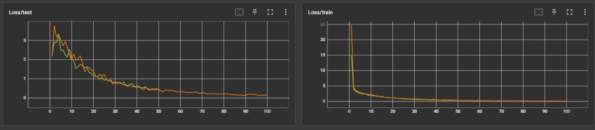

# MultiCamTracking
## Introduction
Unsupervised model for person Re Identification throught multiple camera

This is repository is largerly inspired by <a href='#1'>"Unsupervised Pre-training for Person Re-identification (2021)"</a>[1] paper.

It aims to re-identify a person or a car through multiple camera thanks to an unsupervised siamese model trained on Market-1501[2]


The pipeline is composed with 4 main steps:
- Person detection using YoloV8 and image extraction of the interesting person
- Person detection on another video using YoloV8
- Tracking using StrongSORT
- Similarity between the reference and every person detected in the other video


## Get starting 

### Yolov8
Clone mikel-brostrom/yolov8_tracking repository
```
git clone https://github.com/mikel-brostrom/yolov8_tracking
```

### Training dataset
To download the training dataset (<a href="#2">Market-1501</a>), use
```bash
curl https://www.kaggle.com/datasets/pengcw1/market-1501/download?datasetVersionNumber=1
```

### torchereid pretrained models
To download pretrained weights : https://kaiyangzhou.github.io/deep-person-reid/MODEL_ZOO

Then change 
```python
torchereidModels(name='<name>', weights='<path>')
```
with your desired name and path

## Metrics


## References
<a id="1" href="https://doi.org/10.48550/arXiv.2012.03753">[1]</a> 
<b>Unsupervised Pre-training for Person Re-identification (2021)</b><br>
Dengpan Fu, Dongdong Chen, Jianmin Bao, Hao Yang, Lu Yuan, Lei Zhang, Houqiang Li, Dong Chen<br>
<a href="https://doi.org/10.48550/arXiv.2012.03753">arXiv:2012.03753</a>

<a id="2" href="https://paperswithcode.com/dataset/market-1501">[2]</a> 
<b>Market-1501</b><br>
<a href='https://www.kaggle.com/datasets/pengcw1/market-1501'>https://www.kaggle.com/datasets/pengcw1/market-1501</a>

<a id="3" href="https://github.com/mikel-brostrom/yolov8_tracking">[3]</a> 
<b>yolov8_tracking</b><br>
mikel-brostrom<br>
<a href='https://github.com/mikel-brostrom/yolov8_tracking'>https://github.com/mikel-brostrom/yolov8_tracking</a>

<a id="4" href="https://arxiv.org/abs/2202.13514">[4]</a> 
<b>StrongSORT: Make DeepSORT Great Again</b><br>
Yunhao Du, Yang Song, Bo Yang, and Yanyun Zhao<br>
<a href='https://arxiv.org/abs/2202.13514'>arXiv:2202.13514</a>

<a id="5" href="https://github.com/KaiyangZhou/deep-person-reid">[5]</a> 
<b>deep-person-reid</b><br>
Kaiyang Zhou<br>
<a href='https://github.com/KaiyangZhou/deep-person-reid'>https://github.com/KaiyangZhou/deep-person-reid</a>

[[6]](https://github.com/samihormi/Multi-Camera-Person-Tracking-and-Re-Identification)
<b>Multi-Camera-Person-Tracking-and-Re-Identification</b><br>
samihormi<br>
https://github.com/samihormi/Multi-Camera-Person-Tracking-and-Re-Identification
